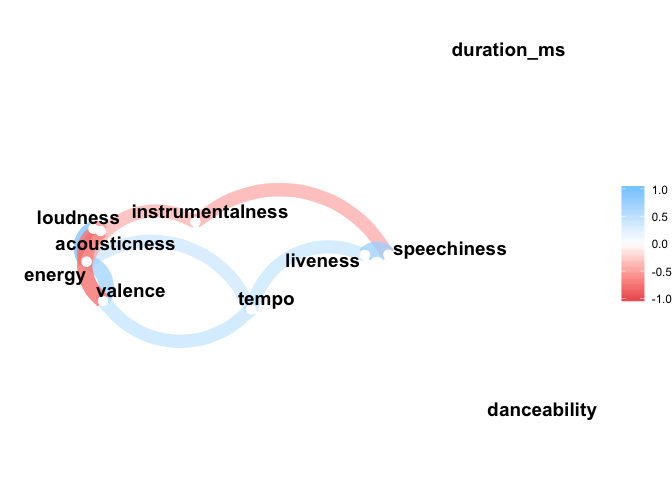
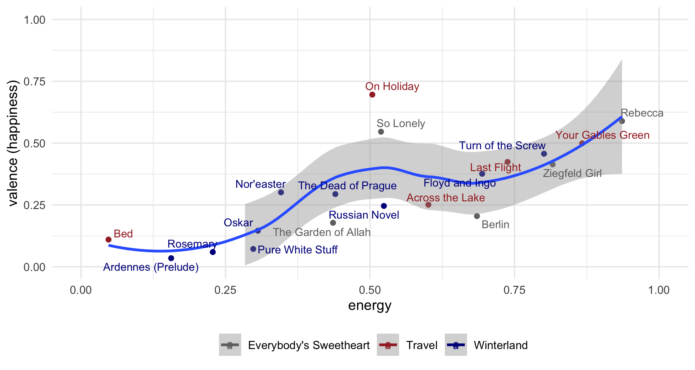
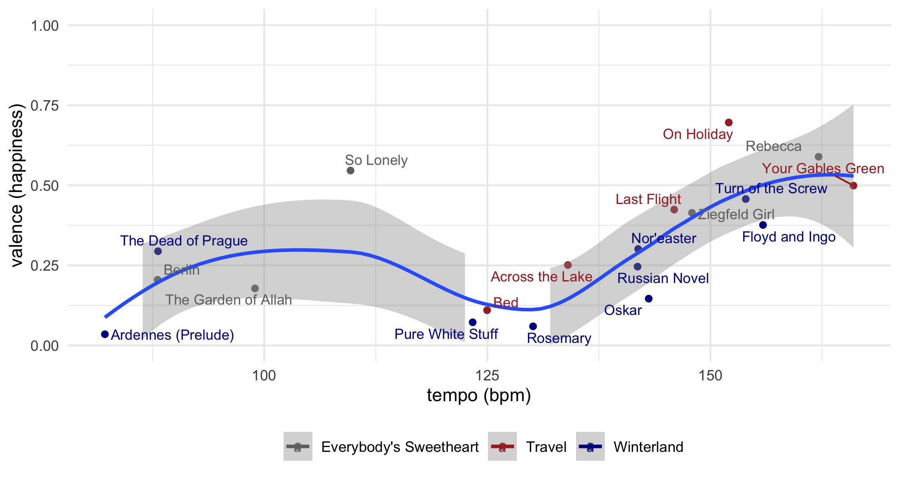
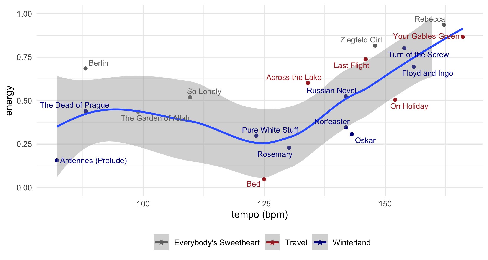

Sad songs & pretty charts:  
*a Gosta Berling music data visualization*
================
greg dubrow
January 21, 2020

## Using the Spoitfy API and spotifyr package to visualize some music I’ve made

For my first post, I thought I’d focus on music analytics, given that
music and data science/analysis are two things I’ve probably spent most
of my waking hours on for a number of years now.

Over the years I’ve made a lot of music in a number of different
projects. For most of my time living in the Bay Area I’ve played with
some friends in a band called [Gosta
Berling](https://gostaberling.bandcamp.com/). We’ve released two EPs and
a full album *(click on the album covers to give
listen)*

[](https://gostaberling.bandcamp.com/album/winterland)
[](https://gostaberling.bandcamp.com/album/travel)
[](https://gostaberling.bandcamp.com/album/everybodys-sweetheart)

Our sound could be called melancholy mood-pop. We like melody, but we
were raised on post-punk and that minor key vibe is definitely present.
So since the Spotify API has musical features including danceability,
energy, and valence (what they call ‘happiness’), I thought I’d try and
learn Charlie Thompson’s
[spotifyr](https://github.com/charlie86/spotifyr) package and see how we
score. spotifyr has a bunch of functions designed to make it easier to
navigate Spotify’s JSON data structure.

So first thing, let’s load the packages we’ll be using:

``` r
library(tidyverse)
library(httr)
library(stringr)
library(lubridate)
library(ggrepel)
library(spotifyr)
library(janitor)
library(GGally)
library(PerformanceAnalytics)
library(corrr)
```

As of June 2019 there were some minor bugs in the CRAN version. They’re
fixed in the dev version, which you can get with this call:

``` r
 devtools::install_github('charlie86/spotifyr', force = TRUE)
```

To get access the Spotify data, you need a developer key. Charlie’s
explained how to do it on the package page, so I won’t repeat that here.
To set up the keys in your .Renviron, run

``` r
usethis::edit_r_environ()
```

and add:

``` r
SPOTIFY_CLIENT_ID = 'xxxxxxxxxxxxxxxxxxxxx'
SPOTIFY_CLIENT_SECRET = 'xxxxxxxxxxxxxxxxxxxxx'

# or do
Sys.setenv(SPOTIFY_CLIENT_ID = 'xxxxxxxxxxxxxxxxxxxxx')
Sys.setenv(SPOTIFY_CLIENT_SECRET = 'xxxxxxxxxxxxxxxxxxxxx')
```

This call sets your access token for the data session

``` r
access_token <- get_spotify_access_token()
```

If you run into redirect issues, see \[this stackoverflow thread
(<https://stackoverflow.com/questions/32956443/invalid-redirect-uri-on-spotify-auth>),
specifically [this
comment](https://stackoverflow.com/a/51967789/102268480)

First thing is to search the artist data for audio features. I’m pulling
in everything into a dataframe

``` r
# gets full range of information for tracks from artist
gosta_audio1 <- get_artist_audio_features(artist = 'Gosta Berling')
glimpse(gosta_audio1)
```

For some reason the search was only returning data for last album
Winterland, so I need to get audio info on a song-by-song basis. At
first just looked up the EP data, but the dataframes came back with
results in a different format than the Winterland data, so I decided to
just get everything the same way.

First, I looked up the album IDs on Spotify:

  - Gosta Berling artist id = 4Vb2yqJJthJTAZxKz4Aryn
  - Travel album id = 0vBs7ZtBj3ROrRyac3M47q
  - Everybody’s Sweetheart album id = 0dJBaJ3VFxOtdG5L9yzALJ
  - Winterland album id = 6CMekiY6lCIuBZpzFDInpf

The code here gets a dataframe for each record. I also needed to add
album title. Next steps were to merge the album dataframes together,
extract the song IDs and pass them to the get\_track\_features()
function as a
list.

``` r
# get album tracks, add album name could merge on other df, easier to quick fix this way
travel <- get_album_tracks(id = "0vBs7ZtBj3ROrRyac3M47q")
travel$album <- "Travel"
sweetheart <- get_album_tracks(id = "0dJBaJ3VFxOtdG5L9yzALJ")
sweetheart$album <- "Everybody's Sweetheart"
winterland  <- get_album_tracks(id = "6CMekiY6lCIuBZpzFDInpf")
winterland$album <- "Winterland"

# merge album files, output track ids to use for audio features
gbtracks <- data.table::rbindlist(list(sweetheart, travel, winterland))
gbtrackids <- dput(as.character(gbtracks$id)) # copy result from console
#> c("2SotrXjkvjTZf05XSMKGyp", "07cTJ65GZ4Lvr6b1CtgPll", "4ooz79IN3la97See8IMNRL", 
#> "7pgCh68iFO0LNUNKWTFFIP", "4ZCesDRgGWKEXwq8iKw5FB", "4ZdH5B3tijHjWiwyOErgtf", 
#> "5GWKeBYgOsv3PKutDIQoet", "0XXWRsY6URe2Vx7Bxs6k06", "0t3AGVXHyF3dEYuhvAYuNz", 
#> "4ObsuwrVLKUq5aF8whrFqk", "0PnjWfIPwsqBtllMILjzxB", "7uQtlGsKxXOzsSapKTZRFU", 
#> "3kQuG44stzA3pQf7g61Ipt", "0YH9wkimhRhCmstNZyxPgO", "7rEbjyNO0dTEK6x8HkLqAz", 
#> "4VgEAtVQtkwIHzKMOROk6X", "5R9M4s6QZljNPVVzxoy98h", "1FNtHQ0juoKg2yCf9u4VSg", 
#> "5NWmfmupE7FEJ9O1e9vizu")

gosta_audio2 <- 
  get_track_audio_features(c("2SotrXjkvjTZf05XSMKGyp", "07cTJ65GZ4Lvr6b1CtgPll",
                                       "4ooz79IN3la97See8IMNRL","7pgCh68iFO0LNUNKWTFFIP", 
                                       "4ZCesDRgGWKEXwq8iKw5FB", "4ZdH5B3tijHjWiwyOErgtf", 
                                       "5GWKeBYgOsv3PKutDIQoet", "0XXWRsY6URe2Vx7Bxs6k06",
                                       "0t3AGVXHyF3dEYuhvAYuNz", "4ObsuwrVLKUq5aF8whrFqk", 
                                       "0PnjWfIPwsqBtllMILjzxB", "7uQtlGsKxXOzsSapKTZRFU", 
                                       "3kQuG44stzA3pQf7g61Ipt", "0YH9wkimhRhCmstNZyxPgO",
                                       "7rEbjyNO0dTEK6x8HkLqAz", "4VgEAtVQtkwIHzKMOROk6X",
                                       "5R9M4s6QZljNPVVzxoy98h", "1FNtHQ0juoKg2yCf9u4VSg", 
                                       "5NWmfmupE7FEJ9O1e9vizu"),
                                     authorization = get_spotify_access_token())
glimpse(gosta_audio2)
#> Observations: 19
#> Variables: 18
#> $ danceability     <dbl> 0.349, 0.573, 0.368, 0.250, 0.473, 0.498, 0.331, 0.5…
#> $ energy           <dbl> 0.8160, 0.4360, 0.9360, 0.5190, 0.6850, 0.6010, 0.86…
#> $ key              <int> 4, 4, 11, 9, 0, 2, 2, 0, 9, 11, 5, 9, 2, 4, 7, 2, 4,…
#> $ loudness         <dbl> -7.203, -9.943, -6.014, -13.356, -6.935, -8.576, -6.…
#> $ mode             <int> 0, 1, 0, 1, 1, 1, 1, 0, 1, 1, 1, 1, 1, 0, 1, 0, 0, 0…
#> $ speechiness      <dbl> 0.0337, 0.0254, 0.1160, 0.0369, 0.0275, 0.0278, 0.04…
#> $ acousticness     <dbl> 0.17500, 0.67700, 0.03260, 0.08340, 0.28200, 0.39300…
#> $ instrumentalness <dbl> 0.23900, 0.84600, 0.00881, 0.91700, 0.53300, 0.77900…
#> $ liveness         <dbl> 0.1020, 0.1050, 0.3220, 0.1280, 0.0703, 0.1230, 0.33…
#> $ valence          <dbl> 0.4140, 0.1780, 0.5890, 0.5460, 0.2050, 0.2510, 0.49…
#> $ tempo            <dbl> 147.920, 98.967, 162.111, 109.672, 88.058, 134.025, …
#> $ type             <chr> "audio_features", "audio_features", "audio_features"…
#> $ id               <chr> "2SotrXjkvjTZf05XSMKGyp", "07cTJ65GZ4Lvr6b1CtgPll", …
#> $ uri              <chr> "spotify:track:2SotrXjkvjTZf05XSMKGyp", "spotify:tra…
#> $ track_href       <chr> "https://api.spotify.com/v1/tracks/2SotrXjkvjTZf05XS…
#> $ analysis_url     <chr> "https://api.spotify.com/v1/audio-analysis/2SotrXjkv…
#> $ duration_ms      <int> 281400, 389040, 221973, 438293, 522760, 353493, 3093…
#> $ time_signature   <int> 4, 3, 4, 3, 4, 4, 4, 3, 4, 3, 4, 4, 4, 3, 4, 4, 4, 4…
```

Result is a dataframe with most of what I want…just a few tweaks needed.
First, since they weren’t pulled from the get\_track\_audio\_features()
call, I got the track id, name, and album track number merge from the
gbtracks dataframe. Also, because the song key returned as only the
numeric value, I created the letter name and mode (major or minor), and
ordered the columns.

``` r
# get track number and name, merge from gbtracks - 
# need b/b not returned from get_track_audio_features()
gbtrack2 <- gbtracks %>%
  select(id, name, album, track_number) %>%
  rename(track_name = name)

# merge to complete df. add names for key and mode
gosta_audio <- left_join(gosta_audio2, gbtrack2) %>%
  mutate(key_name = case_when(key == 0 ~ "C", key == 2 ~ "D", key == 4 ~ "E", 
                              key == 5 ~ "F", key == 7 ~ "G", 
                              key == 9 ~ "A", key == 11 ~ "B")) %>%
  mutate(mode_name = case_when(mode == 0 ~ "Minor", mode == 1 ~ "Major")) %>%
  mutate(key_mode = paste(key_name, mode_name, sep = " ")) %>%
  rename(track_id = id) %>%
  select(album, track_name, track_number, key_mode, time_signature, duration_ms, 
         danceability, energy, loudness, tempo, valence, 
         acousticness, instrumentalness, liveness, speechiness,
         key_name, mode_name, key, mode)
#> Joining, by = "id"
  
glimpse(gosta_audio)
#> Observations: 19
#> Variables: 19
#> $ album            <chr> "Everybody's Sweetheart", "Everybody's Sweetheart", …
#> $ track_name       <chr> "Ziegfeld Girl", "The Garden of Allah", "Rebecca", "…
#> $ track_number     <int> 1, 2, 3, 4, 5, 1, 2, 3, 4, 5, 1, 2, 3, 4, 5, 6, 7, 8…
#> $ key_mode         <chr> "E Minor", "E Major", "B Minor", "A Major", "C Major…
#> $ time_signature   <int> 4, 3, 4, 3, 4, 4, 4, 3, 4, 3, 4, 4, 4, 3, 4, 4, 4, 4…
#> $ duration_ms      <int> 281400, 389040, 221973, 438293, 522760, 353493, 3093…
#> $ danceability     <dbl> 0.349, 0.573, 0.368, 0.250, 0.473, 0.498, 0.331, 0.5…
#> $ energy           <dbl> 0.8160, 0.4360, 0.9360, 0.5190, 0.6850, 0.6010, 0.86…
#> $ loudness         <dbl> -7.203, -9.943, -6.014, -13.356, -6.935, -8.576, -6.…
#> $ tempo            <dbl> 147.920, 98.967, 162.111, 109.672, 88.058, 134.025, …
#> $ valence          <dbl> 0.4140, 0.1780, 0.5890, 0.5460, 0.2050, 0.2510, 0.49…
#> $ acousticness     <dbl> 0.17500, 0.67700, 0.03260, 0.08340, 0.28200, 0.39300…
#> $ instrumentalness <dbl> 0.23900, 0.84600, 0.00881, 0.91700, 0.53300, 0.77900…
#> $ liveness         <dbl> 0.1020, 0.1050, 0.3220, 0.1280, 0.0703, 0.1230, 0.33…
#> $ speechiness      <dbl> 0.0337, 0.0254, 0.1160, 0.0369, 0.0275, 0.0278, 0.04…
#> $ key_name         <chr> "E", "E", "B", "A", "C", "D", "D", "C", "A", "B", "F…
#> $ mode_name        <chr> "Minor", "Major", "Minor", "Major", "Major", "Major"…
#> $ key              <int> 4, 4, 11, 9, 0, 2, 2, 0, 9, 11, 5, 9, 2, 4, 7, 2, 4,…
#> $ mode             <int> 0, 1, 0, 1, 1, 1, 1, 0, 1, 1, 1, 1, 1, 0, 1, 0, 0, 0…
```

The result is a nice tidy dataframe, ready for some analysis.

[Spotify’s developer
pages](https://developer.spotify.com/documentation/web-api/reference/tracks/get-audio-features/)
have good explanations of the data. Some notes from spotify here about
elements:

  - Most of the aduio features are 0-1, 1 being highest. e.g. higher
    speechiness = higher ratio of words::music. Valence is “happiness”,
    where higher = happier.
  - Loundess in dB, tempo is BPM

First I wanted to look at basic correlations for the values. There are a
number of ways to run and visualize correlations in r…a few examples
follow. First thing I needed to do was a subset of the gosta\_audio df
for easier calls with the various correlation packages.

``` r
gbcorr <- gosta_audio[, c(6:15)]
```

Let’s try correlations in base r. You get the coefficients in the
console or you can output to a dataframe to hard-code the visualization.

``` r
cor(gbcorr)
#>                  duration_ms danceability      energy    loudness      tempo
#> duration_ms       1.00000000   0.03575546 -0.09957649  0.16485951 -0.1589364
#> danceability      0.03575546   1.00000000 -0.10466026  0.09671649 -0.2719148
#> energy           -0.09957649  -0.10466026  1.00000000  0.85748849  0.5140085
#> loudness          0.16485951   0.09671649  0.85748849  1.00000000  0.4952005
#> tempo            -0.15893636  -0.27191484  0.51400852  0.49520052  1.0000000
#> valence          -0.04414383  -0.10232090  0.72025346  0.48053791  0.5519247
#> acousticness     -0.19009855   0.11222116 -0.74742026 -0.65043898 -0.3612391
#> instrumentalness  0.12784620   0.06977532 -0.53088295 -0.49709651 -0.4411810
#> liveness         -0.30987073  -0.25213421  0.49374017  0.30054882  0.5316901
#> speechiness      -0.30678610  -0.31639826  0.45449667  0.27298422  0.4217976
#>                      valence acousticness instrumentalness   liveness
#> duration_ms      -0.04414383   -0.1900986       0.12784620 -0.3098707
#> danceability     -0.10232090    0.1122212       0.06977532 -0.2521342
#> energy            0.72025346   -0.7474203      -0.53088295  0.4937402
#> loudness          0.48053791   -0.6504390      -0.49709651  0.3005488
#> tempo             0.55192475   -0.3612391      -0.44118097  0.5316901
#> valence           1.00000000   -0.7793878      -0.29646550  0.4743309
#> acousticness     -0.77938779    1.0000000       0.39266796 -0.3261889
#> instrumentalness -0.29646550    0.3926680       1.00000000 -0.3406087
#> liveness          0.47433091   -0.3261889      -0.34060869  1.0000000
#> speechiness       0.41684028   -0.3150009      -0.56643572  0.7459700
#>                  speechiness
#> duration_ms       -0.3067861
#> danceability      -0.3163983
#> energy             0.4544967
#> loudness           0.2729842
#> tempo              0.4217976
#> valence            0.4168403
#> acousticness      -0.3150009
#> instrumentalness  -0.5664357
#> liveness           0.7459700
#> speechiness        1.0000000
gbcorrs1 <- as.data.frame(cor(gbcorr))
gbcorrs1
#>                  duration_ms danceability      energy    loudness      tempo
#> duration_ms       1.00000000   0.03575546 -0.09957649  0.16485951 -0.1589364
#> danceability      0.03575546   1.00000000 -0.10466026  0.09671649 -0.2719148
#> energy           -0.09957649  -0.10466026  1.00000000  0.85748849  0.5140085
#> loudness          0.16485951   0.09671649  0.85748849  1.00000000  0.4952005
#> tempo            -0.15893636  -0.27191484  0.51400852  0.49520052  1.0000000
#> valence          -0.04414383  -0.10232090  0.72025346  0.48053791  0.5519247
#> acousticness     -0.19009855   0.11222116 -0.74742026 -0.65043898 -0.3612391
#> instrumentalness  0.12784620   0.06977532 -0.53088295 -0.49709651 -0.4411810
#> liveness         -0.30987073  -0.25213421  0.49374017  0.30054882  0.5316901
#> speechiness      -0.30678610  -0.31639826  0.45449667  0.27298422  0.4217976
#>                      valence acousticness instrumentalness   liveness
#> duration_ms      -0.04414383   -0.1900986       0.12784620 -0.3098707
#> danceability     -0.10232090    0.1122212       0.06977532 -0.2521342
#> energy            0.72025346   -0.7474203      -0.53088295  0.4937402
#> loudness          0.48053791   -0.6504390      -0.49709651  0.3005488
#> tempo             0.55192475   -0.3612391      -0.44118097  0.5316901
#> valence           1.00000000   -0.7793878      -0.29646550  0.4743309
#> acousticness     -0.77938779    1.0000000       0.39266796 -0.3261889
#> instrumentalness -0.29646550    0.3926680       1.00000000 -0.3406087
#> liveness          0.47433091   -0.3261889      -0.34060869  1.0000000
#> speechiness       0.41684028   -0.3150009      -0.56643572  0.7459700
#>                  speechiness
#> duration_ms       -0.3067861
#> danceability      -0.3163983
#> energy             0.4544967
#> loudness           0.2729842
#> tempo              0.4217976
#> valence            0.4168403
#> acousticness      -0.3150009
#> instrumentalness  -0.5664357
#> liveness           0.7459700
#> speechiness        1.0000000
```

Or you could let some packages do the viz work for you. First, the
ggally package.

``` r
ggcorr(gbcorr, label = TRUE)
```


With the corrr package I tried a couple of approaches. First a basic
matrix that prints to the console, and doesn’t look much different than
base r.

``` r
gbcorr %>%
  correlate(use = "pairwise.complete.obs", method = "spearman")
#> 
#> Correlation method: 'spearman'
#> Missing treated using: 'pairwise.complete.obs'
#> # A tibble: 10 x 11
#>    rowname duration_ms danceability energy loudness  tempo valence acousticness
#>    <chr>         <dbl>        <dbl>  <dbl>    <dbl>  <dbl>   <dbl>        <dbl>
#>  1 durati…     NA            0.0799 -0.319   -0.189 -0.439  -0.191      -0.0737
#>  2 dancea…      0.0799      NA      -0.269   -0.124 -0.323  -0.209       0.128 
#>  3 energy      -0.319       -0.269  NA        0.872  0.658   0.761      -0.725 
#>  4 loudne…     -0.189       -0.124   0.872   NA      0.574   0.458      -0.595 
#>  5 tempo       -0.439       -0.323   0.658    0.574 NA       0.665      -0.479 
#>  6 valence     -0.191       -0.209   0.761    0.458  0.665  NA          -0.770 
#>  7 acoust…     -0.0737       0.128  -0.725   -0.595 -0.479  -0.770      NA     
#>  8 instru…      0.135        0.0333 -0.447   -0.586 -0.416  -0.177       0.339 
#>  9 livene…     -0.319       -0.321   0.319    0.144  0.479   0.488      -0.103 
#> 10 speech…     -0.331       -0.715   0.382    0.283  0.640   0.396      -0.209 
#> # … with 3 more variables: instrumentalness <dbl>, liveness <dbl>,
#> #   speechiness <dbl>
```

Next, I used their rplot call and then a network graph

``` r
gbcorrs2 <- correlate(gbcorr)
#> 
#> Correlation method: 'pearson'
#> Missing treated using: 'pairwise.complete.obs'
rplot(gbcorrs2)
#> Don't know how to automatically pick scale for object of type noquote. Defaulting to continuous.
```


``` r
   # network graph
correlate(gbcorr) %>% 
  network_plot(min_cor=0.5)
#> 
#> Correlation method: 'pearson'
#> Missing treated using: 'pairwise.complete.obs'
```



And finally the performance analytics package, which was the first of
the packages to include significance levels in the default output.

``` r
#chart.Correlation(gbcorr, histogram=TRUE, pch="+")
chart.Correlation(gbcorr, histogram = FALSE, method = c("pearson", "kendall", "spearman"))
```


Given the correlations, I was interested in exploring the relationships
a bit more. So I ran a few scatterplots, with song titles as data
labels, and dots colored by album name (using primary color from the
cover) to see also if any of the albums clustered at all along either
axis. The ggrepel package is used to move the labels off of the dots

First, up, energy and happiness. Spotify uses the term valence to
signify happiness, or “musical positiveness”. For energy, as they put it
“Typically, energetic tracks feel fast, loud, and noisy.” Again, [see
the API
documentation](https://developer.spotify.com/documentation/web-api/reference/tracks/get-audio-features/)
for definitions.

``` r
gosta_audio %>%
  ggplot(aes(energy, valence, color = album)) +
  geom_point() +
  geom_smooth(aes(color = NULL)) +
  geom_text_repel(aes(label = track_name), size = 3) +
  scale_color_manual(values = c("#707070", "brown", "dark blue")) +
  ylim(0, 1) +
  xlim(0, 1) +
  theme_minimal() +
  labs(x = "energy", y = "valence (happiness)") +
  theme(legend.position = "bottom", legend.title = element_blank())
#> `geom_smooth()` using method = 'loess' and formula 'y ~ x'
```



There is a bit of a relationship between the Energy score and Valence -
so our more energetic songs are our happiest songs. Another interesting
way to explore this would be to do some sentiment analysis on the lyics
and see if there’s a relationship between energy, valence and using
words considered to be more positive in nature.

Next I wondered if there’s a relationship between song tempo (beats per
minute) & happiness. Our average BPM is 131, which isn’t too far the the
mid-range of songs on Spotify. The histogram below comes from the
[Spotify API page](https://developer.spotify.com/assets/audio/tempo.png)


So let’s see the code and resulting scatterplot…

``` r
gosta_audio %>%
  ggplot(aes(tempo, valence, color = album)) +
  geom_point() +
  geom_smooth(aes(color = NULL)) +
  geom_text_repel(aes(label = track_name), size = 3) +
  scale_color_manual(values = c("#707070", "brown", "dark blue")) + 
  ylim(0, 1) +
  theme_minimal() +
  labs(x = "tempo (bpm)", y = "valence (happiness)") +
  theme(legend.position = "bottom", legend.title = element_blank())
#> `geom_smooth()` using method = 'loess' and formula 'y ~ x'
```

 It’s not until
we get to about the 130 BPM range is it that our songs start to get to
about a .5 valence (happiness) score, and from there the relationship
between tempo & happiness really kicks in.

Finally, tempo and energy

``` r
gosta_audio %>%
  ggplot(aes(tempo, energy, color = album)) +
  geom_point() +
  geom_smooth(aes(color = NULL)) +
  geom_text_repel(aes(label = track_name), size = 3) +
  scale_color_manual(values = c("#707070", "brown", "dark blue")) +
  ylim(0, 1) +
  theme_minimal() +
  labs(x = "tempo (bpm)", y = "energy") +
  theme(legend.position = "bottom", legend.title = element_blank())
#> `geom_smooth()` using method = 'loess' and formula 'y ~ x'
```



So yes, most of our songs are in the bottom half of the happy scale. And
there does seem to be a bit of a relationship between tempo, energy and
happiness and of course a relationship between tempo and energy

So if you like slightly melancholy mood-pop that’s in the 130 +/- BPM
range, I think you’ll like us.
