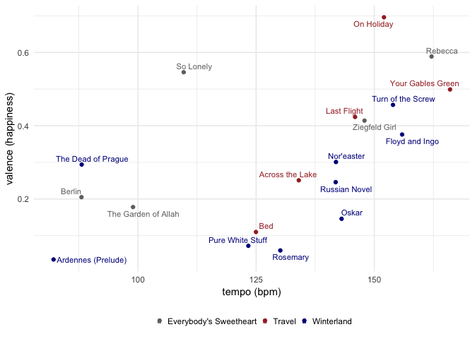

Gosta Berling analysis
================
greg dubrow
June 11, 2019

## Using the Spoitfy API and spotifyr package to visualize some music I’ve made

Over the years I’ve made a lot of music in a number of different
projects. For most of my time living in the Bay Area I’ve played with
some friends in a band called [Gosta
Berling](https://gostaberling.bandcamp.com/). We’ve released two EPs and
a full album *(click on the album covers to give
listen)*

[](https://gostaberling.bandcamp.com/album/winterland)
[](https://gostaberling.bandcamp.com/album/travel)
[](https://gostaberling.bandcamp.com/album/everybodys-sweetheart)

Our sound could be called melancholy mood-pop. We like melody, but we
were raised on post-punk and that minor key vibe is definitely present.
So since the Spotify API has musical features including danceability,
energy, and valence (what they call ‘happiness’), I thought I’d try and
learn Charlie Thompson’s
[spotifyr](https://github.com/charlie86/spotifyr) package and see how we
score. spotifyr has a bunch of functions designed to make it easier to
navigate Spotify’s JSON data structure.

So first thing, let’s load the packages we’ll be using:

``` r
library(tidyverse)
library(httr)
library(stringr)
library(lubridate)
library(ggrepel)
library(spotifyr)
```

As of June 2019 there were some minor bugs in the CRAN version. They’re
fixed in the dev version, which you can get with this call:

``` r
 devtools::install_github('charlie86/spotifyr', force = TRUE)
```

To get access the Spotify data, you need a developer key. Charlie’s
explained how to do it on the package page, so I won’t repeat that here.
To set up the keys in your .Renviron, run

``` r
usethis::edit_r_environ()
```

and add:

``` r
SPOTIFY_CLIENT_ID = 'xxxxxxxxxxxxxxxxxxxxx'
SPOTIFY_CLIENT_SECRET = 'xxxxxxxxxxxxxxxxxxxxx'

# or do
Sys.setenv(SPOTIFY_CLIENT_ID = 'xxxxxxxxxxxxxxxxxxxxx')
Sys.setenv(SPOTIFY_CLIENT_SECRET = 'xxxxxxxxxxxxxxxxxxxxx')
```

This call sets your access token for the data session

``` r
access_token <- get_spotify_access_token()
```

If you run into redirect issues, see \[this stackoverflow thread
(<https://stackoverflow.com/questions/32956443/invalid-redirect-uri-on-spotify-auth>),
specifically [this
comment](https://stackoverflow.com/a/51967789/102268480)

First thing is to search the artist data for audio features. I’m pulling
in everything into a dataframe

``` r
# gets full range of information for tracks from artist
gosta_audio1 <- get_artist_audio_features(artist = 'Gosta Berling')
glimpse(gosta_audio1)
```

For some reason the search was only returning data for last album
Winterland, so I need to get audio info on a song-by-song basis. At
first just looked up the EP data, but the dataframes came back with
results in a different format than the Winterland data, so I decided to
just get everything the same way.

First, I looked up the album IDs on Spotify: Gosta Berling artist id =
4Vb2yqJJthJTAZxKz4Aryn Travel album id 0vBs7ZtBj3ROrRyac3M47q
Everybody’s Sweetheart album id 0dJBaJ3VFxOtdG5L9yzALJ Winterland
album id 6CMekiY6lCIuBZpzFDInpf

The code here gets a dataframe for each record. I also needed to add
album title. Next steps were to merge the album dataframes together,
extract the song IDs and pass them to the get\_track\_features()
function as a
list.

``` r
# get album tracks, add album name could merge on other df, easier to quick fix this way
travel <- get_album_tracks(id = "0vBs7ZtBj3ROrRyac3M47q")
travel$album <- "Travel"
sweetheart <- get_album_tracks(id = "0dJBaJ3VFxOtdG5L9yzALJ")
sweetheart$album <- "Everybody's Sweetheart"
winterland  <- get_album_tracks(id = "6CMekiY6lCIuBZpzFDInpf")
winterland$album <- "Winterland"

# merge album files, output track ids to use for audio features
gbtracks <- data.table::rbindlist(list(sweetheart, travel, winterland))
gbtrackids <- dput(as.character(gbtracks$id)) # copy result from console
#> c("2SotrXjkvjTZf05XSMKGyp", "07cTJ65GZ4Lvr6b1CtgPll", "4ooz79IN3la97See8IMNRL", 
#> "7pgCh68iFO0LNUNKWTFFIP", "4ZCesDRgGWKEXwq8iKw5FB", "4ZdH5B3tijHjWiwyOErgtf", 
#> "5GWKeBYgOsv3PKutDIQoet", "0XXWRsY6URe2Vx7Bxs6k06", "0t3AGVXHyF3dEYuhvAYuNz", 
#> "4ObsuwrVLKUq5aF8whrFqk", "0PnjWfIPwsqBtllMILjzxB", "7uQtlGsKxXOzsSapKTZRFU", 
#> "3kQuG44stzA3pQf7g61Ipt", "0YH9wkimhRhCmstNZyxPgO", "7rEbjyNO0dTEK6x8HkLqAz", 
#> "4VgEAtVQtkwIHzKMOROk6X", "5R9M4s6QZljNPVVzxoy98h", "1FNtHQ0juoKg2yCf9u4VSg", 
#> "5NWmfmupE7FEJ9O1e9vizu")

gosta_audio2 <- 
  get_track_audio_features(c("2SotrXjkvjTZf05XSMKGyp", "07cTJ65GZ4Lvr6b1CtgPll",
                                       "4ooz79IN3la97See8IMNRL","7pgCh68iFO0LNUNKWTFFIP", 
                                       "4ZCesDRgGWKEXwq8iKw5FB", "4ZdH5B3tijHjWiwyOErgtf", 
                                       "5GWKeBYgOsv3PKutDIQoet", "0XXWRsY6URe2Vx7Bxs6k06",
                                       "0t3AGVXHyF3dEYuhvAYuNz", "4ObsuwrVLKUq5aF8whrFqk", 
                                       "0PnjWfIPwsqBtllMILjzxB", "7uQtlGsKxXOzsSapKTZRFU", 
                                       "3kQuG44stzA3pQf7g61Ipt", "0YH9wkimhRhCmstNZyxPgO",
                                       "7rEbjyNO0dTEK6x8HkLqAz", "4VgEAtVQtkwIHzKMOROk6X",
                                       "5R9M4s6QZljNPVVzxoy98h", "1FNtHQ0juoKg2yCf9u4VSg", 
                                       "5NWmfmupE7FEJ9O1e9vizu"),
                                     authorization = get_spotify_access_token())
glimpse(gosta_audio2)
#> Observations: 19
#> Variables: 18
#> $ danceability     <dbl> 0.349, 0.573, 0.368, 0.250, 0.473, 0.498, 0.331…
#> $ energy           <dbl> 0.8160, 0.4360, 0.9360, 0.5190, 0.6850, 0.6010,…
#> $ key              <int> 4, 4, 11, 9, 0, 2, 2, 0, 9, 11, 5, 9, 2, 4, 7, …
#> $ loudness         <dbl> -7.203, -9.943, -6.014, -13.356, -6.935, -8.576…
#> $ mode             <int> 0, 1, 0, 1, 1, 1, 1, 0, 1, 1, 1, 1, 1, 0, 1, 0,…
#> $ speechiness      <dbl> 0.0337, 0.0254, 0.1160, 0.0369, 0.0275, 0.0278,…
#> $ acousticness     <dbl> 0.17500, 0.67700, 0.03260, 0.08340, 0.28200, 0.…
#> $ instrumentalness <dbl> 0.23900, 0.84600, 0.00881, 0.91700, 0.53300, 0.…
#> $ liveness         <dbl> 0.1020, 0.1050, 0.3220, 0.1280, 0.0703, 0.1230,…
#> $ valence          <dbl> 0.4140, 0.1780, 0.5890, 0.5460, 0.2050, 0.2510,…
#> $ tempo            <dbl> 147.920, 98.967, 162.111, 109.672, 88.058, 134.…
#> $ type             <chr> "audio_features", "audio_features", "audio_feat…
#> $ id               <chr> "2SotrXjkvjTZf05XSMKGyp", "07cTJ65GZ4Lvr6b1CtgP…
#> $ uri              <chr> "spotify:track:2SotrXjkvjTZf05XSMKGyp", "spotif…
#> $ track_href       <chr> "https://api.spotify.com/v1/tracks/2SotrXjkvjTZ…
#> $ analysis_url     <chr> "https://api.spotify.com/v1/audio-analysis/2Sot…
#> $ duration_ms      <int> 281400, 389040, 221973, 438293, 522760, 353493,…
#> $ time_signature   <int> 4, 3, 4, 3, 4, 4, 4, 3, 4, 3, 4, 4, 4, 3, 4, 4,…
```

Result is a dataframe with most of what I want…just a few tweaks needed.
First, since they weren’t pulled from the get\_track\_audio\_features()
call, I got the track id, name, and album track number merge from the
gbtracks dataframe. Also, because the song key returned as only the
numeric value, I created the letter name and mode (major or minor), and
ordered the columns.

``` r
# get track number and name, merge from gbtracks - 
# need b/b not returned from get_track_audio_features()
gbtrack2 <- gbtracks %>%
  select(id, name, album, track_number) %>%
  rename(track_name = name)

# merge to complete df. add names for key and mode
gosta_audio <- left_join(gosta_audio2, gbtrack2) %>%
  mutate(key_name = case_when(key == 0 ~ "C", key == 2 ~ "D", key == 4 ~ "E", 
                              key == 5 ~ "F", key == 7 ~ "G", 
                              key == 9 ~ "A", key == 11 ~ "B")) %>%
  mutate(mode_name = case_when(mode == 0 ~ "Minor", mode == 1 ~ "Major")) %>%
  mutate(key_mode = paste(key_name, mode_name, sep = " ")) %>%
  rename(track_id = id) %>%
  select(album, track_name, track_number, key_mode, time_signature, duration_ms, 
         danceability, energy, loudness, tempo, valence, 
         acousticness, instrumentalness, liveness, speechiness,
         key_name, mode_name, key, mode)
#> Joining, by = "id"
  
glimpse(gosta_audio)
#> Observations: 19
#> Variables: 19
#> $ album            <chr> "Everybody's Sweetheart", "Everybody's Sweethea…
#> $ track_name       <chr> "Ziegfeld Girl", "The Garden of Allah", "Rebecc…
#> $ track_number     <int> 1, 2, 3, 4, 5, 1, 2, 3, 4, 5, 1, 2, 3, 4, 5, 6,…
#> $ key_mode         <chr> "E Minor", "E Major", "B Minor", "A Major", "C …
#> $ time_signature   <int> 4, 3, 4, 3, 4, 4, 4, 3, 4, 3, 4, 4, 4, 3, 4, 4,…
#> $ duration_ms      <int> 281400, 389040, 221973, 438293, 522760, 353493,…
#> $ danceability     <dbl> 0.349, 0.573, 0.368, 0.250, 0.473, 0.498, 0.331…
#> $ energy           <dbl> 0.8160, 0.4360, 0.9360, 0.5190, 0.6850, 0.6010,…
#> $ loudness         <dbl> -7.203, -9.943, -6.014, -13.356, -6.935, -8.576…
#> $ tempo            <dbl> 147.920, 98.967, 162.111, 109.672, 88.058, 134.…
#> $ valence          <dbl> 0.4140, 0.1780, 0.5890, 0.5460, 0.2050, 0.2510,…
#> $ acousticness     <dbl> 0.17500, 0.67700, 0.03260, 0.08340, 0.28200, 0.…
#> $ instrumentalness <dbl> 0.23900, 0.84600, 0.00881, 0.91700, 0.53300, 0.…
#> $ liveness         <dbl> 0.1020, 0.1050, 0.3220, 0.1280, 0.0703, 0.1230,…
#> $ speechiness      <dbl> 0.0337, 0.0254, 0.1160, 0.0369, 0.0275, 0.0278,…
#> $ key_name         <chr> "E", "E", "B", "A", "C", "D", "D", "C", "A", "B…
#> $ mode_name        <chr> "Minor", "Major", "Minor", "Major", "Major", "M…
#> $ key              <int> 4, 4, 11, 9, 0, 2, 2, 0, 9, 11, 5, 9, 2, 4, 7, …
#> $ mode             <int> 0, 1, 0, 1, 1, 1, 1, 0, 1, 1, 1, 1, 1, 0, 1, 0,…
```

The result is a nice tidy dataframe, ready for some analysis.

[Spotify’s developer
pages](https://developer.spotify.com/documentation/web-api/reference/tracks/get-audio-features/)
have good explanations of the data. Some notes from spotify here about
elements:

  - Most of the aduio features are 0-1, 1 being highest. e.g. higher
    speechiness = higher ratio of words::music. Valence is “happiness”,
    where higher = happier.
  - Loundess in dB, tempo is BPM

First I wondered if there’s a relationship between song tempo &
happiness? So, a scatterplot, with song titles as data labels, and dots
colored by album name (using primary color from the cover) to see also
if any of the albums clustered at all along either axis. ggrepel is used
to move the labels off of the dots

``` r
gosta_audio %>%
  ggplot(aes(tempo, valence, color = album)) +
  geom_point() +
  geom_text_repel(aes(label = track_name), size = 3) +
  scale_color_manual(values = c("#707070", "brown", "dark blue")) +
  theme_minimal() +
  labs(x = "tempo (bpm)", y = "valence (happiness)") +
  theme(legend.position = "bottom", legend.title = element_blank())
```



So yes, most of our songs are in the bottom half of the happy scale. And
there does seem to be a bit of a relationship between temp and
happiness.
